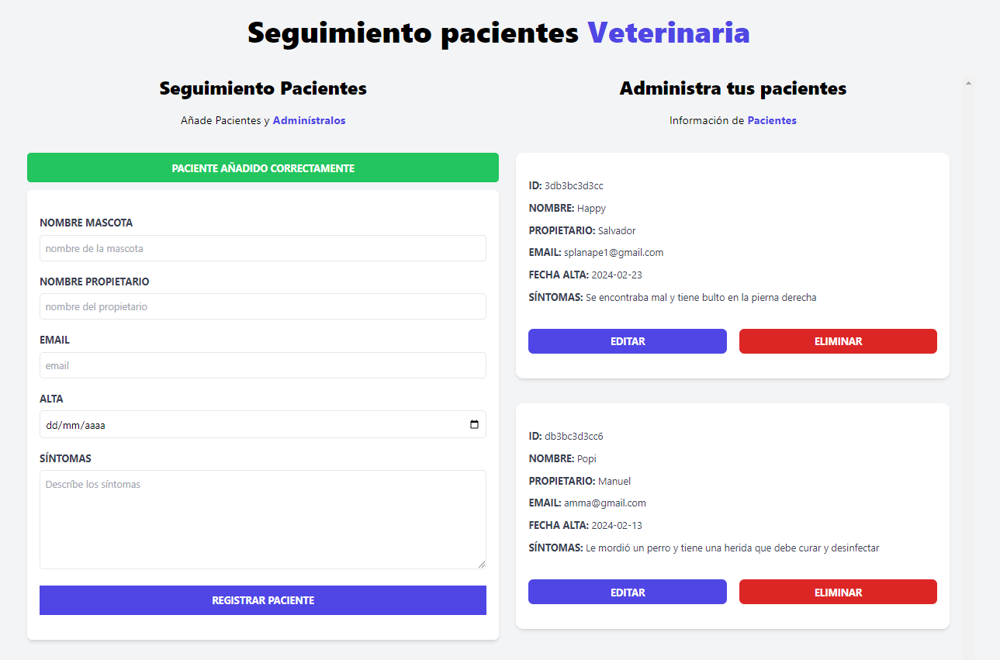

# Proyecto Administrar Pacientes
Este proyecto ha sido realizado con VueJs y permite la administración de los pacientes, registrando sus datos, pudiéndolos editar o eliminar. No tiene un backend, pero sí que los datos los almacena correctamente en el local storage.

# Imagen de como se ve la web

